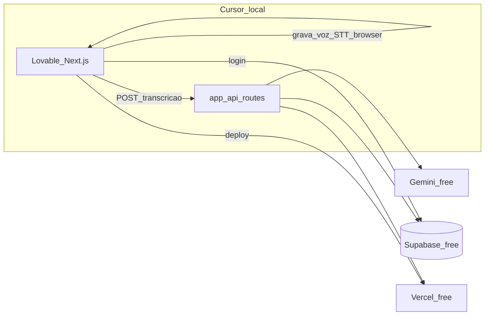

# Grace Hopper no Cursor — MVP gratuito com Lovable

Guia passo a passo para construir o Grace Hopper no Cursor usando template Lovable como frontend, com backend mínimo gratuito (Next.js API Routes + Supabase + Gemini), **sem FastAPI** por enquanto.

---

## Decisões fechadas

| Decisão | Escolha |
|---------|---------|
| Frontend | Template **Lovable** já escolhido → exportar para o Cursor |
| Backend | **Next.js API Routes** na Vercel (sem FastAPI agora) |
| Banco + Auth | **Supabase** free tier (Google OAuth) |
| IA | **Gemini** via Google AI Studio (chave gratuita) |
| Voz (MVP) | **Web Speech API** no browser (grátis; sem Google Cloud STT) |
| Deploy | **Vercel** hobby (um único deploy) |
| Custo | **R$ 0** — evitar serviços que exigem cartão (ex.: Google Cloud STT) |

---

## Checklist de progresso

- [ ] Exportar template Lovable para GitHub/pasta local e abrir no Cursor
- [ ] Criar contas free: Supabase + Gemini; configurar `.env.local` e `.gitignore`
- [ ] Aplicar design-system Grace Hopper e criar rotas shell (landing, login, dashboard, interview, feedback)
- [ ] Integrar Supabase Auth Google OAuth + RLS + tabelas interviews/feedback
- [ ] Implementar fluxo entrevista: gerar pergunta, Web Speech API, API Route analyze com Gemini
- [ ] Telas de feedback e dashboard com histórico real do Supabase
- [ ] Deploy Vercel, README portfólio, Miro + LinkedIn demo

---

## Arquitetura do MVP



---

## Páginas do MVP (da documentação)

Fonte: [grace_hopper_product_os.md](./grace_hopper_product_os.md) e [user-journey.md](./user-journey.md)

1. **Landing** — branding, visão, CTA
2. **Login** — Google via Supabase
3. **Dashboard** — histórico, score, progresso
4. **Entrevista** — pergunta + gravação de voz
5. **Feedback** — score, strengths, improvements (estrutura em [ai-system.md](./ai-system.md))

---

## Design system a aplicar no Lovable/Cursor

De [design-system.md](./design-system.md):

- Primary: `#F4A642`
- Background: `#F7F4EE`
- Neutral: `#1A1A1A`
- Border: `#ECE6DB`
- Estilo: calmo, minimalista, cantos arredondados, muito espaço em branco

---

## Fase 0 — Preparar o workspace no Cursor (~30 min)

### Passo 1: Exportar o Lovable para código local

1. No Lovable: **Export → GitHub** (recomendado) ou download ZIP.
2. No Cursor: **File → Open Folder** na pasta do projeto exportado.
3. Confirme a stack: idealmente **Next.js + TypeScript + Tailwind** (alinhado ao [GRACE_HOPPER_ADR.md](./GRACE_HOPPER_ADR.md)).
   - Se o template for **Vite + React**: ainda funciona no Vercel, mas prefira migrar para Next.js depois; para o MVP, pode seguir com Vite se o template já estiver pronto.

### Passo 2: Estrutura de pastas sugerida

```
Project Grace Hooper/
├── grace-hopper-web/          ← código do Lovable (abrir ESTA pasta no Cursor)
├── grace_hopper_ai_docs (2)/  ← docs de referência (não commitar secrets)
└── README.md                  ← case do portfólio (criar depois)
```

### Passo 3: Dar contexto ao Agent do Cursor

1. Crie `.cursor/rules` (ou use `@` nos prompts) apontando para:
   - [design-system.md](./design-system.md)
   - [product-overview.md](./product-overview.md)
   - [ai-system.md](./ai-system.md)
2. Prompt inicial útil no Agent:

   > "Implemente o Grace Hopper MVP seguindo as docs em @grace_hopper_ai_docs (2). Stack: Next.js, Supabase, Gemini. Sem FastAPI. Cores do design-system."

### Passo 4: Rodar localmente

```bash
cd grace-hopper-web
npm install
npm run dev
```

Abra `http://localhost:3000` (ou porta do Vite).

---

## Fase 1 — Ajustar o template Lovable ao Grace Hopper (~1–2 dias)

### Passo 5: Branding e landing

No Cursor (Agent ou edição manual), peça/adapte:

- Nome **Grace Hopper**, tagline da [product-overview.md](./product-overview.md)
- Hero: problema + solução + CTA "Começar entrevista"
- Paleta do design-system no `tailwind.config` / CSS variables

### Passo 6: Rotas/páginas vazias (shell)

Criar estrutura de rotas antes de integrar APIs:

| Rota | Função |
|------|--------|
| `/` | Landing |
| `/login` | Redirect Supabase OAuth |
| `/dashboard` | Histórico + scores |
| `/interview` | Escolher tipo + iniciar |
| `/interview/[id]` | Sessão ativa (pergunta + mic) |
| `/feedback/[id]` | Resultado da IA |

### Passo 7: Componentes reutilizáveis

Aproveite shadcn/ui do template Lovable:

- `ScoreBar`, `FeedbackCard`, `InterviewTypeSelector`, `RecordButton`
- Layout com sidebar ou header simples para dashboard

---

## Fase 2 — Contas gratuitas e variáveis (~1 hora)

### Passo 8: Supabase (free)

1. [supabase.com](https://supabase.com) → novo projeto free.
2. **Authentication → Providers → Google** (configurar OAuth no Google Cloud Console — gratuito).
3. Criar tabelas mínimas:

```sql
-- interviews
create table interviews (
  id uuid primary key default gen_random_uuid(),
  user_id uuid references auth.users not null,
  type text, -- technical | behavioral | situational
  question text,
  transcript text,
  created_at timestamptz default now()
);

-- feedback
create table feedback (
  id uuid primary key default gen_random_uuid(),
  interview_id uuid references interviews(id),
  score int,
  strengths jsonb,
  improvements jsonb,
  communication_feedback text,
  technical_feedback text,
  created_at timestamptz default now()
);
```

4. Ativar **RLS**: usuário só vê seus próprios registros.

### Passo 9: Gemini (free)

1. [aistudio.google.com](https://aistudio.google.com) → criar API key.
2. **Nunca** commitar a key — só `.env.local`.

### Passo 10: `.env.local` no projeto web

```env
NEXT_PUBLIC_SUPABASE_URL=
NEXT_PUBLIC_SUPABASE_ANON_KEY=
SUPABASE_SERVICE_ROLE_KEY=   # só no servidor / API Routes
GEMINI_API_KEY=
```

Adicionar `.env.local` ao `.gitignore`.

---

## Fase 3 — Auth e dashboard (~2 dias)

### Passo 11: Login Google (Supabase)

- Instalar `@supabase/supabase-js` e `@supabase/ssr` (se Next.js App Router).
- Cliente browser + middleware para proteger `/dashboard`, `/interview`, `/feedback`.
- Fluxo: Landing CTA → `/login` → OAuth Google → `/dashboard`.

**Prompt Cursor:**

> "Integre Supabase Auth com Google OAuth. Proteja rotas privadas. Após login, redirecione para /dashboard."

### Passo 12: Dashboard com dados reais

- Listar `interviews` + `feedback` do usuário logado.
- Cards: data, tipo, score, link "Ver feedback".
- Estado vazio: "Faça sua primeira entrevista".

---

## Fase 4 — Core WOW: entrevista + IA (~3–4 dias)

### Passo 13: Página de entrevista

1. Usuário escolhe tipo (technical / behavioral / situational).
2. API Route `POST /api/interview/start`:
   - Gera pergunta via Gemini (prompt simples; pode cachear exemplos no MVP).
   - Salva `interviews` no Supabase.
3. UI mostra pergunta + botão gravar.

### Passo 14: Voz no browser (grátis)

- Usar **Web Speech API** (`webkitSpeechRecognition` ou `SpeechRecognition`).
- Ao parar gravação: preencher `transcript` na UI.
- Fallback MVP: textarea "Cole sua resposta" se o mic falhar.

**Prompt Cursor:**

> "Implemente gravação de voz com Web Speech API em português. Mostre transcrição em tempo real. Botão enviar para análise."

### Passo 15: Análise com Gemini

API Route `POST /api/interview/analyze`:

- Input: `interviewId`, `transcript`, `type`
- Prompt pedindo JSON conforme [ai-system.md](./ai-system.md):

```json
{
  "score": 8,
  "strengths": [],
  "improvements": [],
  "communication_feedback": "",
  "technical_feedback": ""
}
```

- Salvar em `feedback`, redirecionar para `/feedback/[id]`.

### Passo 16: Tela de feedback

- Score visual (barras estilo README)
- Listas strengths / improvements
- CTA: "Nova entrevista" → `/interview`

---

## Fase 5 — Polish e deploy (~2–3 dias)

### Passo 17: Responsividade e UX

- Mobile-first na gravação (permissão de mic).
- Loading states ("Analisando com IA...").
- Tratamento de erro (Gemini timeout, mic negado).

### Passo 18: Deploy Vercel (grátis)

1. Push para **GitHub** (repo público para portfólio).
2. [vercel.com](https://vercel.com) → Import project.
3. Configurar **Environment Variables** (mesmas do `.env.local`).
4. URL final: `grace-hopper.vercel.app` (ou similar).

### Passo 19: README do repositório

Incluir: problema, solução, stack, screenshots, link live, link Miro (quando pronto).

### Passo 20: Entregáveis de portfólio (semana 2 da doc)

Conforme [grace_hopper_product_os.md](./grace_hopper_product_os.md):

- Miro boards (visão, journey, MVP scope, backlog lite, arquitetura)
- Post LinkedIn + demo em vídeo (30–60s)

---

## Cronograma sugerido (~10–12 dias úteis)

| Dias | Foco |
|------|------|
| 1 | Fase 0 + Fase 1 (export Lovable, branding, rotas) |
| 2 | Fase 2 + início Fase 3 (Supabase, Gemini, login) |
| 3–4 | Dashboard + listagem |
| 5–7 | Entrevista + voz + Gemini + feedback |
| 8–9 | Polish UI + responsivo |
| 10 | Deploy Vercel + README |
| 11–12 | Miro + LinkedIn + vídeo demo |

---

## Como usar o Cursor em cada passo (padrão de trabalho)

1. **Abra a pasta do projeto web** (não só a pasta de docs).
2. **@ mencione** arquivos de doc relevantes no chat.
3. **Um pedido por vez** no Agent (ex.: só auth, depois só dashboard).
4. **Revise o diff** antes de aceitar; teste `npm run dev` após cada feature.
5. **Terminal integrado** para `npm run dev`, `npm run build` (build antes do deploy).
6. Use **Plan mode** para features grandes; **Agent mode** para implementar.

### Exemplos de prompts prontos

- *"Crie a rota /api/interview/analyze que chama Gemini e retorna JSON do ai-system.md"*
- *"Adapte a landing do template Lovable com cores #F4A642 e #F7F4EE do design-system"*
- *"Proteja /dashboard com Supabase middleware no App Router"*

---

## O que fica para o futuro (FastAPI / pago)

Quando quiser evoluir (não no MVP):

- FastAPI no Render free para STT Google e lógica Python
- Gamificação, AI recruiter (roadmap V2 em [roadmap.md](./roadmap.md))

---

## Checklist de "pronto para mostrar"

- [ ] Login Google funciona
- [ ] Uma entrevista completa: pergunta → voz/texto → feedback em < 10s (meta doc: < 3s ideal)
- [ ] Dashboard mostra histórico
- [ ] Deploy público na Vercel
- [ ] README + screenshots
- [ ] Nenhuma API key no GitHub
