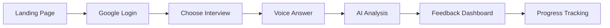

# User Journey

```mermaid
flowchart LR
    A[Landing Page] --> B[Google Login]
    B --> C[Choose Interview]
    C --> D[Voice Answer]
    D --> E[AI Analysis]
    E --> F[Feedback Dashboard]
    F --> G[Progress Tracking]
```

## Main Loop
1. User starts interview
2. Answers by voice
3. AI analyzes response
4. User receives feedback
5. User practices again
